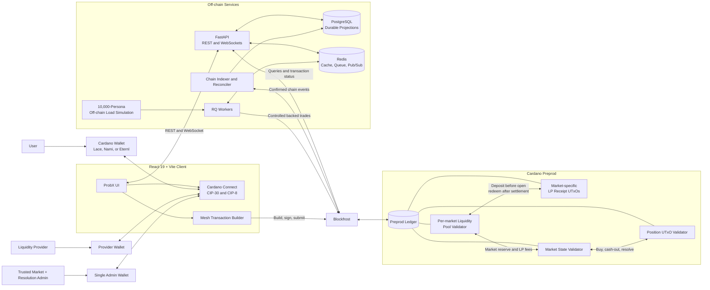

# ProbX

**A Cardano-powered statement prediction market with transparent custody and live cash-out.**

**Live deployment:** <https://probx.devcrew.dev/>

## Overview

ProbX is a general prediction platform where people can create clear statements about future events and others can choose whether they believe the answer will be YES or NO. A statement might ask whether ADA will reach a certain price, whether a product will launch before a date, or whether a public event will happen. Markets can cover crypto, technology, economics, entertainment, sports, and other topics, provided that the final result can be checked objectively.

A user connects a Cardano wallet and submits a free opening forecast without committing funds. After the market collects 100 unique signed forecasts, its opening probability is `YES forecasts / 100` instead of an automatic 50/50. A unanimous result is bounded to 99/1 so neither side opens at a zero price. Once the market is funded, users commit demo ADA to YES or NO and the probability continues to move with each position. In phase one, a user may fully cash out a position before the deadline at a value that can be higher or lower than the amount originally committed.

Current-value cash-outs require real liquidity; the platform cannot safely create extra ADA when a position becomes more valuable. Each ProbX market therefore has its own community-funded liquidity pool. Funds are locked by a Cardano smart contract rather than sent to an admin wallet, and providers receive market-specific LP receipts. LP funds remain locked until that market is resolved or voided, preventing one market's risk from being transferred to providers in another market.

Cardano acts as ProbX's transparent digital vault and rulebook. Smart contracts hold user stakes and market-specific liquidity, record who owns each position, check price changes, prevent the same position from being paid twice, stop new trades after the deadline, and send payouts only to eligible wallets. These rules are public and run on Cardano preprod, so the application backend cannot secretly edit balances or move money. Users review and sign every transaction from their own wallets.

For the hackathon MVP, one disclosed admin wallet reviews proposed statements and provides the single required signature for a YES, NO, or VOID outcome with supporting evidence. This 1-of-1 resolution model is deliberately trusted and centralized; it is not presented as an oracle or decentralized governance. The admin signs facts but never receives custody of user stakes or liquidity-provider funds, cannot cash out user positions, and cannot redirect contract payouts. If the admin does not sign before the resolution deadline, anyone may trigger VOID. A production version should add category-specific data oracles, an evidence challenge and dispute window, and multi-party quorum governance.

The React website and FastAPI backend handle the parts that do not need to run on Cardano, including market discovery, charts, draft reviews, notifications, portfolio summaries, and live updates. PostgreSQL stores searchable application history, Redis handles temporary queues and messages, and Blockfrost connects the application to Cardano preprod. The blockchain remains the final source of truth whenever an off-chain record disagrees with the funds or positions held by the contracts.

To make the demo feel active, ProbX runs a clearly labeled off-chain load simulation containing 10,000 virtual participants with different forecasting strategies. Simulation markets may use 100 disclosed simulated opening forecasts, while real markets require unique signed wallet forecasts. Only occasional, controlled simulation actions become real preprod transactions. The simulation demonstrates backend scale and is never presented as 10,000 real people or 10,000 concurrent Cardano transactions.

ProbX is a testnet-only hackathon MVP. It uses preprod test ADA, has not been audited, and must not be used for real-money predictions or deployed to Cardano mainnet.

## Current implementation

The first end-to-end vertical slice is implemented:

- `frontend/` contains the React/Vite application, wallet connection, API integration, transaction-signing boundary, every planned route, and a polished fallback demo.
- `backend/` contains FastAPI, real CIP-8 verification, PostgreSQL models and migration, Redis/RQ/WebSockets, market and forecast workflows, projections, an idempotent seed, and unsigned transaction-building payloads.
- `contracts/` contains the compiled Aiken market, per-market liquidity, position, LP receipt, and receipt-token validators plus the generated `plutus.json` blueprint.
- `docker-compose.yml` runs PostgreSQL, Redis, the API, worker, and Vite frontend locally.

The local application and contract logic work without credentials. Real Blockfrost submission, script deployment, thread-token bootstrap, and chain indexing are the next integration milestone; current transaction endpoints intentionally return `NOT_SUBMITTED` building parameters and never claim a transaction has confirmed.

## Run locally

Prerequisites are Docker with Compose, Node.js 22, Python 3.12 with `uv`, and Aiken 1.1.23.

```bash
docker compose up --build
```

The local workspace already contains its `.env`. On a fresh clone, recreate it from the
variables documented in `frontend/README.md` and `backend/README.md`; the repository intentionally
does not rely on a root `.env.example` template.

Then open:

- ProbX: <http://localhost:5173>
- FastAPI documentation: <http://localhost:8000/docs>
- API health: <http://localhost:8000/health>

Demo mode seeds one ordinary price-discovery market, one clearly disclosed simulation market, exactly 100 simulated opening forecasts, per-market liquidity, and the 10,000-persona load-lab state. It creates no wallet funds and submits no Cardano transaction.

Run all automated tests with:

```bash
make test
make check
```

Copy real Blockfrost and deployed-script values only into the untracked `.env` file. Never place a wallet seed phrase in this repository.

## MVP goals

- Connect Lace, Nami, or Eternl without email authentication.
- Authenticate backend requests with a wallet-signed CIP-8 challenge.
- Let users submit structured binary statement proposals across multiple categories.
- Let an admin normalize and approve unambiguous resolution terms.
- Collect 100 unique signed opening forecasts and derive the opening probability from them.
- Let any wallet fund a specific market and receive an on-chain LP receipt.
- Open trading only after price discovery and minimum market liquidity are complete.
- Buy YES or NO positions and move the displayed probability.
- Fully cash out positions at the current curve value before the deadline.
- Resolve as YES, NO, or VOID with one transparent admin-wallet signature in the hackathon MVP.
- Redeem winning or voided positions from the contract.
- Show portfolio exposure, estimated value, resolved profit, charts, and activity.
- Demonstrate backend load with 10,000 clearly labeled simulated personas.
- Run application services locally with Docker while using Cardano preprod.

## What ProbX is not

ProbX does not implement:

- a bookmaker-style private balance controlled only by the backend;
- an order book, limit orders, or price-time matching;
- 10,000 funded on-chain bot wallets;
- arbitrary free-text markets that bypass admin review;
- partial cash-out in the first implementation phase;
- a global liquidity fund that spreads risk across unrelated markets;
- an automated multi-source resolution oracle in the MVP;
- mainnet or real-value wagering.

## Economic model

### Positions

Each position is an individual on-chain UTxO containing:

- market identifier;
- owner payment-key hash;
- YES or NO outcome;
- share quantity;
- amount paid;
- entry probability;
- maximum payout; and
- market-specific position identifier.

A user buys shares from a discrete, integer-only prediction-market curve. If the selected outcome wins, each remaining share has a defined redemption value. Losing shares redeem for zero.

### Probability and price

- A market begins in price discovery rather than automatically displaying 50/50.
- Exactly 100 unique wallet-signed forecasts determine the opening YES percentage.
- One payment credential contributes at most one opening forecast per market.
- Opening probability is `YES count / 100`, bounded to the tradable range 1%–99%.
- The backend stores the signed forecasts and commits their Merkle root and counts on-chain.
- The disclosed admin wallet signs the opening snapshot once before funds can be traded.
- Clearly labeled simulation markets may use 100 disclosed virtual forecasts.
- A bounded 100-step integer cost table determines later buy and cash-out amounts.
- Buying YES moves YES probability upward; buying NO moves it downward.
- The Aiken validator verifies every allowed curve transition.
- The UI may display a marginal mark-to-market estimate, but execution uses the exact cost-table difference.
- A quote is valid only for the market state UTxO from which it was calculated. If another transaction moves the market first, the user receives a fresh quote.

### Cash-out

Cash-out burns an entire position and pays the reverse curve value. Users who want flexible exits can create several smaller positions.

Cash-out is available only before the fixed market deadline. It is not a refund of the original stake: its value may be higher or lower depending on probability movement.

### Liquidity and solvency

User stake starts at zero, but each market must reach its own community-funded liquidity threshold before trading opens. That market reserve backs appreciated cash-outs and winning payouts.

- Any connected wallet may deposit tADA into a selected market's liquidity validator.
- A deposit creates an owner-specific receipt recording LP units for that market only.
- LP capital remains locked until the market is resolved or voided and its claims are settled.
- The prediction pool and liquidity reserve are shown separately in the UI.
- Minimum position size is calculated from current Cardano minimum-UTxO requirements, expected fees, and a safety buffer.
- There is no arbitrary maximum per-wallet stake; available market collateral provides the upper bound.
- The contracts still enforce an unavoidable solvency limit: a transaction is rejected if worst-case liabilities would exceed locked collateral.
- Each buy and cash-out pays a 1% liquidity fee to that market's LP pool; no fee goes to the admin.
- Liquidity providers share that market's fees and market-making gains or losses pro rata.
- After settlement, each provider redeems their LP receipt for its pro-rata share of remaining market value.

## Trust model

| Responsibility | Authority |
| --- | --- |
| Wallet ownership | CIP-30 wallet and CIP-8 signature |
| Market draft/review | FastAPI and PostgreSQL |
| Final market terms | Admin-signed approval accepted by the contract |
| User stakes | Market and position script UTxOs |
| Liquidity reserve | Community-funded, market-specific script UTxO |
| LP ownership | Owner-signed receipt for one market |
| Funds and positions | Cardano validators |
| Probability transition | Discrete curve verified by Aiken |
| Opening probability | 100 signed forecasts plus one admin snapshot signature |
| Market result | Trusted 1-of-1 admin signature or timeout-triggered VOID |
| Portfolio and charts | Indexed on-chain history |
| Simulated activity | Clearly labeled backend engine |

Single-admin resolution is a deliberate hackathon simplification. Every UI surface must label it trusted and centralized rather than presenting it as a decentralized oracle. The admin key can approve terms and sign an outcome, but it cannot spend user positions, withdraw LP funds, cash out on a user's behalf, or redirect settlement payouts. Production requires category-appropriate data oracles, a dispute window, and multi-party quorum governance.

## System architecture



Cardano is authoritative for collateral, liquidity ownership, market state, position ownership, and settlement. PostgreSQL stores signed opening forecasts, approval workflows, and replayable read projections; Redis contains only replaceable operational data. The single admin wallet authorizes terms and outcomes but never holds pooled funds.

### Repository layout

```text
probx/
  frontend/             React 19 + Vite SPA
  backend/              FastAPI application and workers
    app/
      api/
      auth/
      db/
      indexer/
      models/
      repositories/
      schemas/
      services/
      simulation/
      websocket/
      workers/
  contracts/            Aiken validators and tests
  docker/               Container configuration
  docs/                 Architecture and demo documentation
  scripts/              Deployment, seeding, and demo helpers
  docker-compose.yml
  README.md
```

ProbX is isolated from the existing PredictCardano application so that its working demo remains intact and useful code can be migrated selectively.

## Technology

### Frontend

- React 19 and TypeScript
- Vite
- React Router
- TailwindCSS and shadcn/ui
- TanStack Query
- Zustand
- React Hook Form
- TradingView Lightweight Charts
- [Cardano Connect with Wallet](https://developers.cardano.org/tools/cardano-connect-with-wallet/) for wallet-selection UI
- Mesh SDK for transaction building

### Backend

- Python 3.12
- FastAPI with async routes
- Pydantic v2
- SQLAlchemy and Alembic
- PostgreSQL
- Redis
- RQ workers
- WebSockets

### Cardano

- Cardano preprod
- Aiken Plutus V3 validators
- Mesh SDK
- Blockfrost
- CIP-30 wallet access
- CIP-8 signed authentication challenges
- Inline datums, reference scripts where useful, and unique thread tokens

## On-chain design

### Per-market liquidity validator

Every market has an isolated liquidity state UTxO funded by independent provider wallets. Deposits create owner-specific LP receipts tied to that market. Funds cannot cross into another market or return to providers until the market reaches a terminal, fully settled state.

It must:

- let any wallet deposit tADA into a selected market before trading opens;
- issue LP units from that market's contributed value;
- require the provider signature when consuming an LP receipt;
- bind every receipt to exactly one market thread token;
- conserve the market's liquidity, user collateral, fees, and liabilities;
- prevent the admin, backend, or another provider from withdrawing someone else's value;
- reject all LP withdrawals while trading, resolution, or user claims remain open; and
- distribute terminal market value pro rata when LP receipts are redeemed.

The admin approval permits market activation but does not provide a spending path to an admin address. Value may move only among the market liquidity state, valid user positions, and signing LPs after settlement.

### LP receipt validator

Each liquidity deposit creates an owner-specific receipt containing its units and market thread token. Phase one supports full receipt redemption only after the market settles. Receipts do not promise principal protection: providers share that market's realized fees, gains, and losses.

### Market validator

The market datum contains:

```text
market_id
terms_hash
metadata_hash
creator_pkh
resolution_admin_key_hash
trading_deadline
resolution_deadline
resolution_criteria_hash
opening_poll_root
opening_yes_count
opening_no_count
probability_tick
yes_quantity
no_quantity
curve_config
user_collateral
market_liquidity
yes_liability
no_liability
liquidity_fee_bps
status
resolution_outcome
thread_token
```

Redeemers:

```text
Activate
FinalizeOpening
BuyPosition
CashOut
Resolve
Void
Redeem
FinalizeMarket
```

The validator must ensure:

- one continuing state UTxO carries the market thread token;
- immutable terms never change after activation;
- trading cannot open until 100 forecasts, a committed poll root, one admin snapshot signature, and minimum liquidity are present;
- opening counts total exactly 100 and set the bounded 1%–99% probability tick;
- trades use the correct curve entry and preserve value;
- buys and cash-outs pay the exact 1% fee to that market's liquidity pool;
- cash-outs burn an entire position owned by the signer;
- liabilities remain fully collateralized;
- buys and cash-outs occur strictly before the trading deadline;
- YES or NO resolution occurs only after the trading deadline with the configured admin wallet's signature;
- anyone may select VOID if the admin has not signed an outcome after the resolution deadline;
- winning positions receive the defined payout exactly once;
- open positions in a voided market recover their recorded amount paid; and
- LP value can be finalized only after user claims are complete or expired.

### Position validator

The position validator protects an individual prediction ticket. Spending it requires the owner's signature and a matching market transition, except for terminal redemption rules explicitly permitted by the contract.

Using a UTxO per position avoids storing an ever-growing list of bettors in the market datum. A market still has a single mutable state UTxO, which serializes trades; this is acceptable for a low-concurrency preprod hackathon demo.

## Product flows

### Wallet login

1. The frontend connects a CIP-30 wallet.
2. FastAPI issues a one-time nonce containing domain, network, address, issued time, and expiry.
3. The wallet signs it through CIP-8 data signing.
4. FastAPI verifies the signature, consumes the nonce, and issues a short-lived session token.
5. A new challenge is required after expiry; signatures are never treated as spending authorization.

### Market creation

1. A connected user chooses a supported template or submits a custom binary statement, category, trading deadline, resolution deadline, exact YES criteria, primary source, backup source, and invalid-market rule.
2. The draft remains off-chain and cannot accept positions.
3. An admin may normalize the statement, dates, source, and precise resolution rule so YES and NO are objectively distinguishable.
4. The admin approves and signs the final immutable terms.
5. The creator reviews the normalized terms and signs the activation transaction.
6. The creator supplies minimum-UTxO ADA.
7. The market enters `PRICE_DISCOVERY`; no funded positions can yet be purchased.

### Opening price discovery

1. Wallets sign non-spending YES or NO opening forecasts through CIP-8.
2. One payment credential may contribute only one forecast per market.
3. FastAPI verifies and publishes all 100 signed forecasts and builds their Merkle root.
4. The disclosed admin wallet signs the root and YES/NO counts once.
5. Opening YES probability is `YES count / 100`, bounded to 1%–99%.
6. A disclosed simulation market may use 100 virtual forecasts; ordinary markets may not mix virtual and real forecasts.
7. After confirmation, the market enters `FUNDING`.

### Provide and redeem liquidity

1. A connected wallet chooses one market and an amount of preprod tADA to contribute.
2. The UI shows its opening probability, required minimum liquidity, current contributions, and LP risk.
3. The deposit transaction locks funds in that market's liquidity state and creates a market-specific LP receipt.
4. Anyone may open trading after the configured minimum liquidity is reached.
5. LP receipts cannot be redeemed while the market is active or user claims remain outstanding.
6. After settlement, each LP owner redeems the entire receipt for its pro-rata share of remaining market funds and collected fees without admin permission.

### Buy a position

1. Read the latest confirmed market UTxO.
2. Select YES or NO and enter tADA.
3. Show estimated shares, entry probability, maximum payout, price impact, 1% LP fee, network fee, and minimum received.
4. Build the transaction with Mesh.
5. The wallet signs and submits it.
6. Show submitted, confirming, confirmed, or failed state.
7. If the state UTxO is stale, reload the quote instead of silently changing the trade.

### Full cash-out

1. Select an open position to close completely.
2. Quote exact reverse-curve proceeds against the current market UTxO.
3. Display proceeds, the 1% LP fee, network fee, and price impact.
4. The wallet signs the transaction.
5. Consume and close the position UTxO; no remainder position is created.

### Resolution and redemption

1. Trading and cash-out stop automatically at the trading deadline.
2. The disclosed admin wallet publishes evidence and signs YES, NO, or VOID.
3. The market accepts YES or NO only with that configured admin wallet's single signature.
4. If the admin has not signed by the resolution deadline, anyone may trigger VOID.
5. Winning wallets redeem their positions; open positions in a voided market recover their recorded amount paid.
6. The indexer records realized profit or loss.
7. After the claim window, LP wallets redeem the remaining market value and fees pro rata.

## Backend interfaces

### REST API

```text
POST /auth/challenge
POST /auth/verify

GET  /market-drafts
POST /market-drafts
POST /market-drafts/{id}/review

GET  /markets
GET  /markets/{id}
GET  /markets/{id}/chart
GET  /markets/{id}/opening-forecasts
POST /markets/{id}/opening-forecasts
POST /markets/{id}/activation-payload
POST /markets/{id}/finalize-opening-payload
POST /markets/{id}/position-payload
POST /positions/{id}/cashout-payload
POST /markets/{id}/resolution-payload
POST /markets/{id}/void-payload

GET  /markets/{id}/liquidity
POST /markets/{id}/liquidity/deposit-payload
POST /markets/{id}/liquidity/redeem-payload

GET  /portfolio
GET  /leaderboard
GET  /simulation/status
```

Transaction endpoints return an unsigned transaction or deterministic building parameters. They never spend a user's wallet or mark a transaction confirmed before observing it on-chain.

### WebSockets

```text
/ws/markets
/ws/portfolio
/ws/simulation
```

Messages carry a monotonic sequence number. On reconnect, clients fetch the current REST snapshot before applying subsequent events.

### PostgreSQL

PostgreSQL is the durable source of truth for off-chain workflows and indexed projections:

```text
wallets
wallet_challenges
market_drafts
markets
market_events
opening_forecasts
opening_poll_snapshots
liquidity_contributions
lp_receipts
positions
cashouts
chain_transactions
resolutions
admin_resolution_signatures
simulation_personas
simulation_actions
leaderboard_snapshots
outbox_events
```

Cardano remains authoritative when database projections disagree with custody, price, position ownership, or settlement state.

### Redis and RQ

Redis stores only replaceable data:

- cached market snapshots;
- rate limits;
- RQ jobs;
- simulation schedules; and
- pub/sub messages.

Matching is not an RQ responsibility because ProbX has no order book. Durable WebSocket events originate from a PostgreSQL transactional outbox.

## Frontend pages

```text
/                     Featured and active markets
/markets              Search and filter markets
/markets/:id          Probability chart and position controls
/create                Submit a prediction draft
/liquidity             Find markets seeking liquidity and manage LP receipts
/portfolio             Open, cashed-out, and resolved positions
/leaderboard           Realized-PnL ranking
/simulation            Labeled simulated-liquidity activity
/admin                 Review, approval, and resolution
```

The market page includes:

- immutable statement, category, source, and YES resolution rule;
- opening forecast progress, published signatures, and poll commitment;
- countdown and status;
- YES/NO probability and history chart;
- contributed stake and separate backing reserve;
- current liabilities and available liquidity;
- YES/NO amount form with price impact;
- wallet positions and full cash-out controls;
- recent confirmed activity; and
- transaction links to a preprod explorer.

Portfolio estimated value is explicitly labeled as non-wallet, mark-to-market value until a cash-out confirms. The leaderboard ranks non-simulated wallets primarily by realized tADA profit and also shows prediction accuracy and resolved position count.

## Forecast and load simulation

The simulation models 10,000 database personas with reproducible strategies:

- passive;
- momentum;
- contrarian;
- whale;
- random; and
- scalper.

The simulation primarily exercises FastAPI, PostgreSQL, Redis, WebSockets, chart aggregation, and strategy behavior off-chain. It does not claim that a single Cardano market can process 10,000 simultaneous state-UTxO updates.

RQ may generate frequent candidate actions, but a risk controller submits only a small, configurable number of real preprod transactions from dedicated simulation wallets. Those wallets may fund a simulation market or take positions under the same contract rules as other wallets. Every executable simulated position is collateralized. The UI displays a **Simulation Market** badge and excludes personas from the default leaderboard.

A simulation market may use 100 disclosed persona forecasts to establish its opening probability. A normal market requires 100 unique wallet-signed forecasts; the two sources are never mixed or presented as equivalent.

Fixed random seeds and scripted scenarios keep the judge demo predictable.

## Testing

### Aiken

- Accept market-specific liquidity deposits from multiple unrelated wallets.
- Issue the correct LP units for that market.
- Require the LP owner's signature for receipt redemption.
- Reject admin attempts to withdraw or redirect LP funds.
- Reject all LP redemption before terminal settlement.
- Accept full pro-rata LP redemption after settlement.
- Accept correctly signed market activation.
- Reject unapproved or altered terms.
- Reject trading before price discovery and minimum liquidity complete.
- Require opening counts to total exactly 100.
- Require the configured admin wallet's one signature over the poll root and counts.
- Open at the vote-derived probability and bound unanimous polls to 99/1.
- Accept valid YES and NO purchases.
- Reject a manipulated or stale curve transition.
- Prove monotonic YES/NO movement and curve symmetry across every tick.
- Prove that an immediate buy/cash-out round trip cannot create ADA through rounding.
- Pay the exact 1% fee to the market LP pool.
- Preserve collateral exactly.
- Reject any transaction that breaches worst-case solvency.
- Accept full cash-out before the deadline.
- Reject cash-out after the deadline.
- Reject YES/NO resolution before the deadline or without the configured admin signature.
- Accept permissionless VOID only after the resolution deadline.
- Accept winning redemption and reject losing redemption.
- Refund the recorded paid amount for an open position after VOID.
- Prevent double cash-out and double redemption.
- Release remaining market value to LP receipts only through the terminal path.

### Backend

- Reject expired, replayed, wrong-network, and forged CIP-8 challenges.
- Enforce creator and admin authorization.
- Enforce one opening forecast per payment credential per market.
- Verify all 100 forecast signatures and reproduce the committed Merkle root.
- Keep real and simulated forecast sets separate.
- Index market liquidity deposits, LP receipts, fees, and terminal redemptions.
- Process Blockfrost transactions idempotently.
- Reconcile submitted, confirmed, failed, and rolled-back transactions.
- Deliver transactional-outbox events without losing durable state.
- Calculate portfolio and leaderboard projections from chain events.
- Keep simulation exposure within available contract collateral.

### Frontend

- Handle wallet connection, wrong network, rejected signatures, and insufficient tADA.
- Refresh expired/stale quotes.
- Restore state after WebSocket reconnect.
- Show pending and confirmed transactions distinctly.
- Show dynamic minimum position amounts and Cardano network fees.
- Verify full cash-out and 1% LP-fee calculations against shared test vectors.
- Exercise the complete flow in browser tests at desktop and mobile sizes.

## Delivery milestones

1. **Foundation** — scaffold Vite, FastAPI, PostgreSQL, Redis, Docker Compose, migrations, linting, tests, and CI.
2. **Identity and markets** — wallet connection, CIP-8 sessions, structured drafts, admin normalization, and approval.
3. **Opening discovery** — signed forecasts, uniqueness checks, 100-vote commitment, and one admin attestation.
4. **Contract model** — prove the integer curve and implement per-market liquidity, LP receipt, market, and position validators.
5. **Preprod transactions** — implement activation, market funding, buying, full cash-out, trusted admin resolution, VOID, and redemption.
6. **Indexing and live UI** — confirmations, charts, WebSockets, portfolio, history, and leaderboard.
7. **Simulation** — 10,000-persona backend load test, explicit labeling, and deterministic demo scenarios.
8. **Polish** — responsive exchange UI, error recovery, preprod explorer links, documentation, and demo rehearsal.

## Acceptance demo

The MVP is complete when a reviewer can:

1. Start PostgreSQL, Redis, FastAPI, workers, and the React app through Docker Compose.
2. Connect a creator wallet, submit a structured YES/NO statement, approve it, and activate price discovery.
3. Collect 100 unique signed forecasts and open at their derived probability rather than 50/50.
4. Connect two LP wallets and fund only that market.
5. Demonstrate that the admin wallet cannot withdraw either provider's funds.
6. Buy YES and NO from separate wallets and show the probability and 1% LP fee move on-chain.
7. Fully cash out one position before the deadline.
8. Reach the deadline and resolve with the single configured admin wallet, or demonstrate timeout-triggered VOID.
9. Redeem a winning or voided position and show realized PnL update.
10. Redeem the terminal market value from both LP wallets pro rata.
11. Show the labeled 10,000-persona backend load simulation separately from real preprod activity.

## Security and product limits

- Testnet-only; never request or accept mainnet credentials.
- No seed phrase is entered in the browser or stored by the backend.
- The admin wallet holds no pooled user or liquidity-provider funds; it signs terms and outcomes only.
- Liquidity, stake, fees, and position value remain in market-specific contract UTxOs until valid cash-out, redemption, or terminal LP redemption.
- Simulation-wallet and admin signing keys must be separated from application database credentials.
- Structured custom markets remain inactive until approved and cryptographically bound to normalized terms.
- Opening forecast uniqueness is wallet-based, not person-based, and therefore remains vulnerable to Sybil wallets.
- The UI must calculate and disclose minimum-UTxO requirements and network fees before every funded action.
- A single market state UTxO limits transaction throughput and may produce stale quotes under contention.
- A single admin can report an incorrect outcome. Production requires category-appropriate data oracles, an evidence challenge and dispute window, and multi-party quorum governance.
- Liquidity providers can lose tADA through market-making outcomes; LP deposits are not principal-protected.
- The contracts require independent security review before handling real value.
- Any real-money version would require jurisdiction-specific legal, age, KYC/AML, responsible-gaming, and data-protection review.
